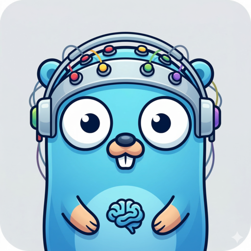

# goxpyriment



`goxpyriment` is a high-level Go framework for building behavioral and psychological experiments.

Check out a few [examples of experiments](https://github.com/chrplr/goxpyriment/releases)

**Goxpyriment can be used to "vibe-code" psychology experiments.** 

Here is how to proceed: 

1. Install Go on your machine (see <https://go.dev/doc/install>). 
2. Clone this repository  (`git clone https://github.com/chrplr/goxpyriment.git` or [download ZIP](https://github.com/chrplr/goxpyriment/archive/refs/heads/main.zip))
3. Fire your favorite AI coding agent (gemini-cli, claude, cursor...) inside goxpyriment folder, then ask it to program your experiment, describing the stimuli, the design, ... in plain language, in Go using the current library.
4. Once the code is created, say in myexp/main.go, you can test it by running the following command in the terminal:

       cd myexp
       go run main.go

5. Lastly, if you want, you can distribute an executable to your colleagues, creating installers for Windows, MacOS and Linux (see an example at <https://github.com/chrplr/retinotopy-go>)

It relies on the [libsdl](http://libsdl.org) library through the [go-sdl3](https://github.com/Zyko0/go-sdl3) bindings. Its API is largely inspired from [expyriment.org](http://expyriment.org) ; see Krause, F., & Lindemann, O. (2014). Expyriment: A Python library for cognitive and neuroscientific experiments. Behavior Research Methods, 46(2), 416-428. <https://doi.org/10.3758/s13428-013-0390-6>.

**NOTE: This software is an alpha version, a proof of concept that without any doubt has some bugs. If you want to try and use it, clone this repository. Check out [expe3000-go](http://github.com/chrplr/expe3000-go) for a less ambitious but efficient, no-code, experiment generator.**


## Features

- **Experimental Design:** Easily define Experiments, Blocks, and Trials with support for factors and randomization.
- **Rich Stimuli Library:**
  - **Visual:** Text (lines and boxes), shapes (rectangles, circles), images, fixation crosses, and Gabor patches.
  - **Audio:** Playback of WAV files and synthetic tones.
- **Hardware Acceleration:** Seamless integration with SDL3 for smooth, high-performance stimulus presentation.
- **Input Handling:** Simplified interfaces for Keyboard and Mouse events.
- **Data Collection:** Automatic logging of trial data to `.xpd` files for later analysis.
- **Timing:** High-precision timing utilities for stimulus duration and reaction time measurement.

## Prerequisites

- **Go:** Version 1.25 or higher.
- **SDL3:** No installation required. `goxpyriment` uses `github.com/Zyko0/go-sdl3` which embeds pre-built SDL3 and SDL3_ttf libraries for Linux, macOS, and Windows (amd64 and arm64) directly inside the binary.

## Installation

```bash
go get github.com/chrplr/goxpyriment
```

## Quick Start

Here is the code of a simple "Hello World" experiment (also at `examples/hello_world/main.go`):

```go
package main

import (
	_ "embed"  // to embed stimuli files, fonts, etc. inside the executable
	"flag"
	"log"

	"github.com/chrplr/goxpyriment/control"
	"github.com/chrplr/goxpyriment/stimuli"
)

//go:embed assets/bonjour.wav
var bonjourWav []byte

func main() {
	develop := flag.Bool("d", false, "Developer mode (windowed 1024x1024)")
	subject := flag.Int("s", 0, "Subject ID")
	flag.Parse()

	width, height, fullscreen := 0, 0, true
	if *develop {
		width, height, fullscreen = 1024, 1024, false
	}

	exp := control.NewExperiment(
		"My First Go Experiment",
		width, height, fullscreen,
		control.Black, // background color
		control.White, // foreground (text) color
		32,            // default font size in points
	)
	exp.SubjectID = *subject
	if err := exp.Initialize(); err != nil {
		log.Fatalf("failed to initialize experiment: %v", err)
	}
	defer exp.End()

	greetings := stimuli.NewTextBox("Hello World !", 600, control.FPoint{X: 0, Y: 100}, control.DefaultTextColor)
	instr := stimuli.NewTextBox("Press any key to start the experiment", 600, control.FPoint{X: 0, Y: 100}, control.DefaultTextColor)
	finish := stimuli.NewTextBox("Experiment Finished!\nPress any key to exit.", 600, control.FPoint{X: 0, Y: 100}, control.DefaultTextColor)

	sound := stimuli.NewSoundFromMemory(bonjourWav)
	if err := sound.PreloadDevice(exp.AudioDevice); err != nil {
		log.Printf("Warning: failed to load sound: %v", err)
	}

	exp.Run(func() error {
		if err := stimuli.PlayPing(exp.AudioDevice); err != nil {
			log.Printf("Warning: failed to play ping: %v", err)
		}
		instr.Present(exp.Screen, true, true)
		exp.Keyboard.Wait()

		sound.Play()
		greetings.Present(exp.Screen, true, true)
		exp.Keyboard.Wait()

		finish.Present(exp.Screen, true, true)
		exp.Keyboard.Wait()

		return control.EndLoop
	})
}
```

To run it directly from within this repository:

```bash
cd examples/hello_world
go run .            # fullscreen by default
go run . -d         # windowed 1024×1024 (developer mode)
go run . -d -s 1    # windowed, subject ID = 1
```

To build a standalone binary:

```bash
cd examples/hello_world
go build -o hello_goxpy .
./hello_goxpy -d
```

Cross-compiling is [straightforward](https://golangcookbook.com/chapters/running/cross-compiling/) in Go — you can build binaries for Windows, macOS, and Linux (Intel or ARM) from any machine.
 

## Project Structure

- `control/`: Experiment lifecycle and state management (window, fonts, colors).
- `design/`: Tools for building the experimental structure (Trials, Blocks).
- `stimuli/`: A comprehensive library of visual and auditory stimuli.
- `io/`: Screen, Keyboard, and Mouse handling.
- `clock/`: Timing utilities.
- `geometry/`: Geometry utilities.
- `examples/`: Ready-to-run examples (Stroop task, Lexical Decision, etc.).

## Building and Running Examples

Run any example directly from the repository root:

```bash
go run ./examples/parity_decision/ -d -s 1
```

Or build and run the binary:

```bash
cd examples/parity_decision
go build .
./parity_decision -d -s 1
```

Most examples accept:
- `-d` — windowed 1024×1024 developer mode (default is exclusive fullscreen)
- `-s <id>` — subject ID written into the `.xpd` data file

To build all examples at once:

```bash
cd examples
./build.sh
```


## License

This project is licensed under the GNU Public License v3 - see the [LICENSE](LICENSE.txt) file for details.

Christophe Pallier, 2026


