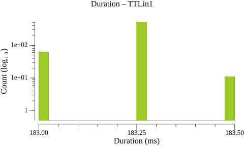
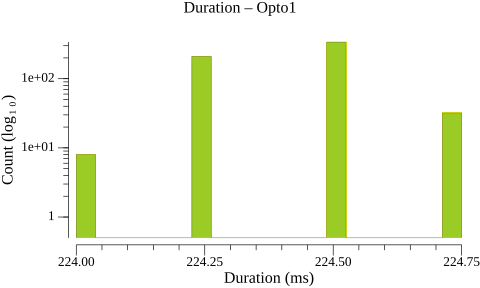
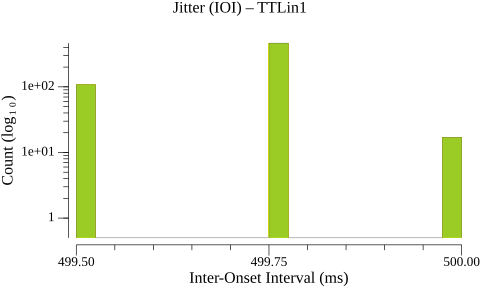
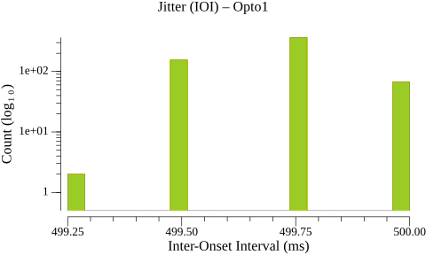
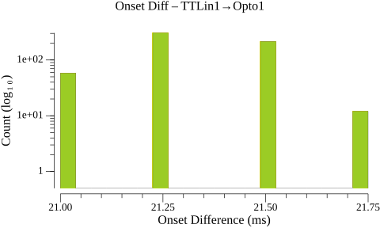
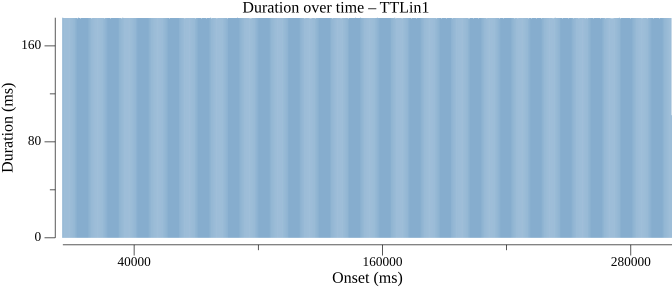
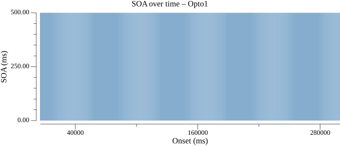

# Events Statistics Report

## Duration Statistics (ms)

| Type | N | Min | P5 | P25 | P50 | P75 | P95 | Max | Range | P95-P05 | Mean | SD |
| --- | --- | --- | --- | --- | --- | --- | --- | --- | --- | --- | --- | --- |
| TTLin1 | 589 | 183.0 | 183.0 | 183.2 | 183.2 | 183.2 | 183.2 | 183.5 | 0.5 | 0.2 | 183.2 | 0.09 |
| Opto1 | 589 | 224.0 | 224.2 | 224.2 | 224.5 | 224.5 | 224.8 | 224.8 | 0.8 | 0.5 | 224.4 | 0.15 |

### Duration Histograms

> **Warning:** 1 outlier(s) excluded from TTLin1 (> 50.000 ms from median)

> **Warning:** 1 outlier(s) excluded from Opto1 (> 50.000 ms from median)

## Inter-Onset Interval / Jitter Statistics (ms)

| Type | N | Min | P5 | P25 | P50 | P75 | P95 | Max | Range | P95-P05 | Mean | SD |
| --- | --- | --- | --- | --- | --- | --- | --- | --- | --- | --- | --- | --- |
| TTLin1 | 589 | 499.5 | 499.5 | 499.8 | 499.8 | 499.8 | 499.8 | 500.0 | 0.5 | 0.2 | 499.7 | 0.11 |
| Opto1 | 589 | 499.2 | 499.5 | 499.5 | 499.8 | 499.8 | 500.0 | 500.0 | 0.8 | 0.5 | 499.7 | 0.15 |

### Jitter Histograms

## Paired-Event Onset Differences relative to TTLin1 (ms)

### Tables

| Type | N | Min | P5 | P25 | P50 | P75 | P95 | Max | Range | P95-P05 | Mean | SD |
| --- | --- | --- | --- | --- | --- | --- | --- | --- | --- | --- | --- | --- |
| TTLin1→Opto1 | 590 | 21.0 | 21.0 | 21.2 | 21.2 | 21.5 | 21.5 | 21.8 | 0.8 | 0.5 | 21.3 | 0.17 |

### Paired-Event Histograms

## Timeline Plots

