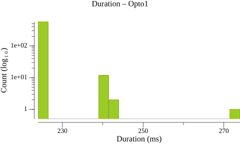
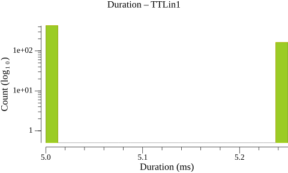
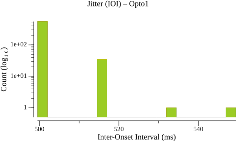
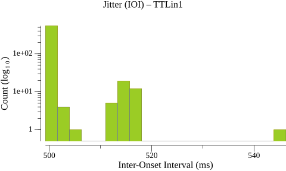
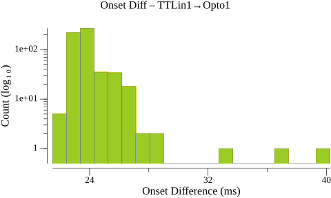
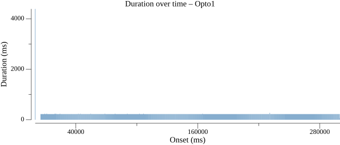
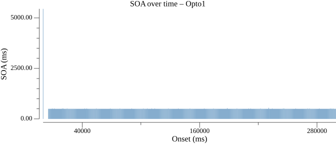
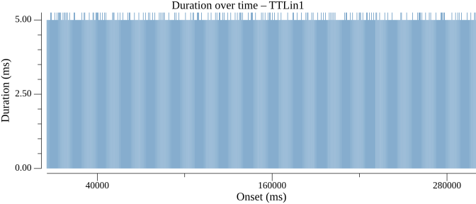
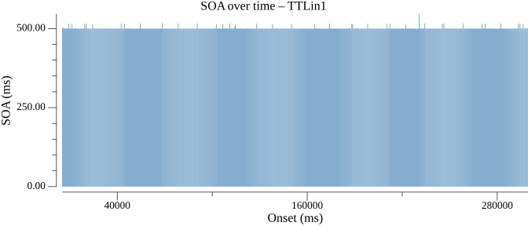

# Events Statistics Report

## Duration Statistics (ms)

| Type | N | Min | P5 | P25 | P50 | P75 | P95 | Max | Range | P95-P05 | Mean | SD |
| --- | --- | --- | --- | --- | --- | --- | --- | --- | --- | --- | --- | --- |
| Opto1 | 588 | 224.0 | 224.2 | 224.2 | 224.2 | 224.5 | 224.8 | 274.0 | 50.0 | 0.5 | 224.8 | 3.25 |
| TTLin1 | 589 | 5.0 | 5.0 | 5.0 | 5.0 | 5.2 | 5.2 | 5.2 | 0.2 | 0.2 | 5.1 | 0.11 |

### Duration Histograms

> **Warning:** 2 outlier(s) excluded from Opto1 (> 50.000 ms from median)

## Inter-Onset Interval / Jitter Statistics (ms)

| Type | N | Min | P5 | P25 | P50 | P75 | P95 | Max | Range | P95-P05 | Mean | SD |
| --- | --- | --- | --- | --- | --- | --- | --- | --- | --- | --- | --- | --- |
| Opto1 | 588 | 499.5 | 499.5 | 499.5 | 499.8 | 499.8 | 516.2 | 549.5 | 50.0 | 16.8 | 500.8 | 4.57 |
| TTLin1 | 588 | 499.2 | 499.5 | 499.8 | 499.8 | 500.0 | 513.7 | 546.2 | 47.0 | 14.2 | 500.8 | 4.12 |

### Jitter Histograms

> **Warning:** 1 outlier(s) excluded from Opto1 (> 50.000 ms from median)

## Paired-Event Onset Differences relative to TTLin1 (ms)

### Tables

| Type | N | Min | P5 | P25 | P50 | P75 | P95 | Max | Range | P95-P05 | Mean | SD |
| --- | --- | --- | --- | --- | --- | --- | --- | --- | --- | --- | --- | --- |
| TTLin1→Opto1 | 589 | 21.5 | 22.8 | 23.2 | 23.5 | 24.0 | 25.8 | 40.2 | 18.8 | 3.0 | 23.8 | 1.32 |

### Paired-Event Histograms

## Timeline Plots

