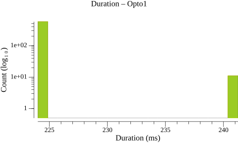
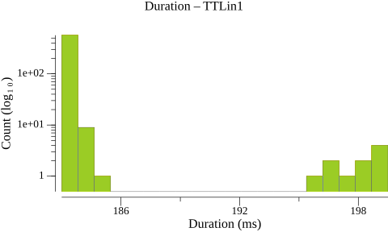
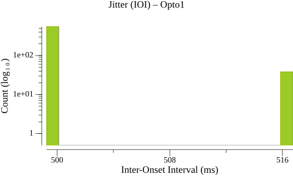
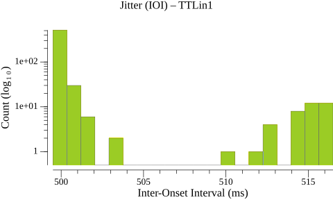
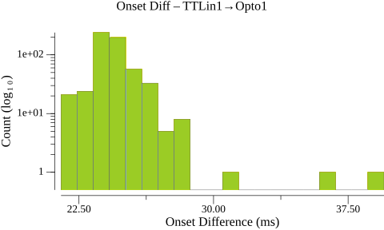
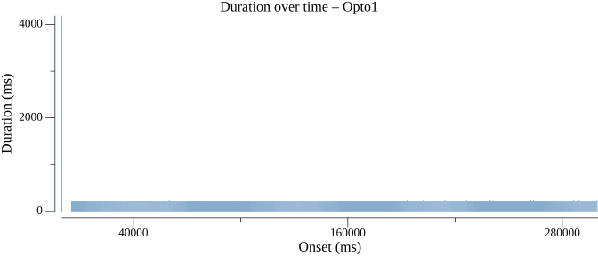
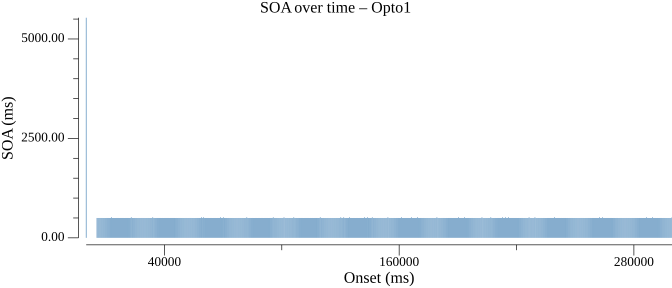
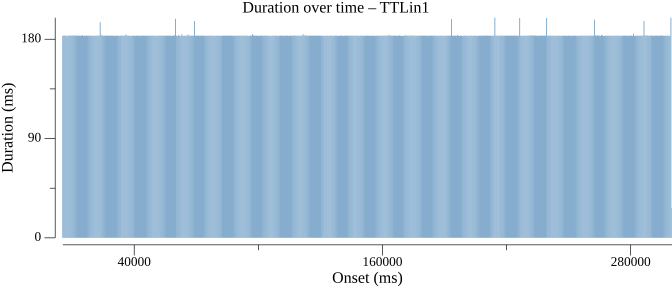
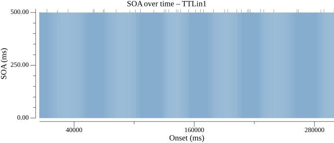

# Events Statistics Report

## Duration Statistics (ms)

| Type | N | Min | P5 | P25 | P50 | P75 | P95 | Max | Range | P95-P05 | Mean | SD |
| --- | --- | --- | --- | --- | --- | --- | --- | --- | --- | --- | --- | --- |
| Opto1 | 588 | 224.0 | 224.2 | 224.2 | 224.5 | 224.5 | 224.8 | 241.2 | 17.2 | 0.5 | 224.7 | 2.26 |
| TTLin1 | 588 | 183.0 | 183.0 | 183.2 | 183.2 | 183.2 | 183.5 | 199.5 | 16.5 | 0.5 | 183.5 | 1.93 |

### Duration Histograms

> **Warning:** 2 outlier(s) excluded from Opto1 (> 50.000 ms from median)

> **Warning:** 1 outlier(s) excluded from TTLin1 (> 50.000 ms from median)

## Inter-Onset Interval / Jitter Statistics (ms)

| Type | N | Min | P5 | P25 | P50 | P75 | P95 | Max | Range | P95-P05 | Mean | SD |
| --- | --- | --- | --- | --- | --- | --- | --- | --- | --- | --- | --- | --- |
| Opto1 | 588 | 499.2 | 499.5 | 499.8 | 499.8 | 499.8 | 516.2 | 516.8 | 17.5 | 16.8 | 500.8 | 4.11 |
| TTLin1 | 588 | 499.5 | 499.5 | 499.8 | 499.8 | 499.8 | 514.2 | 516.5 | 17.0 | 14.8 | 500.8 | 3.74 |

### Jitter Histograms

> **Warning:** 1 outlier(s) excluded from Opto1 (> 50.000 ms from median)

## Paired-Event Onset Differences relative to TTLin1 (ms)

### Tables

| Type | N | Min | P5 | P25 | P50 | P75 | P95 | Max | Range | P95-P05 | Mean | SD |
| --- | --- | --- | --- | --- | --- | --- | --- | --- | --- | --- | --- | --- |
| TTLin1→Opto1 | 589 | 21.5 | 23.1 | 23.8 | 24.2 | 24.8 | 26.2 | 39.5 | 18.0 | 3.1 | 24.4 | 1.35 |

### Paired-Event Histograms

## Timeline Plots

