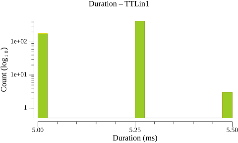
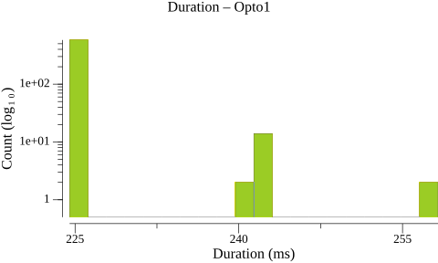
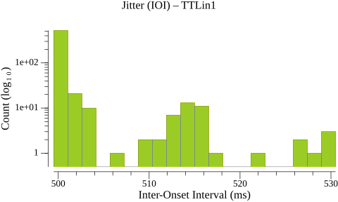
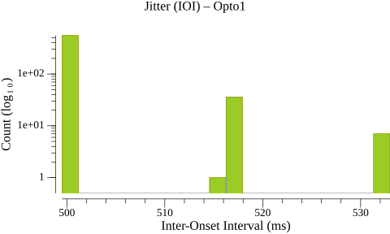
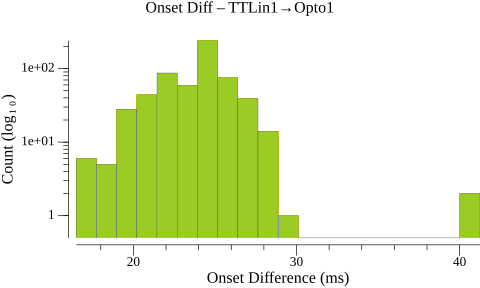
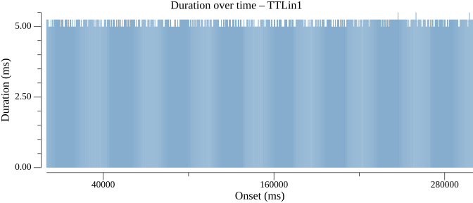
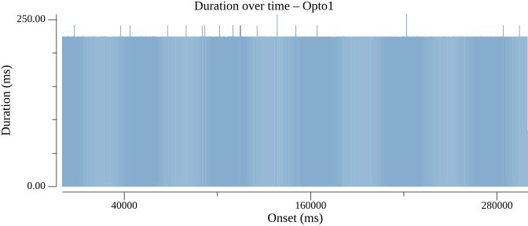
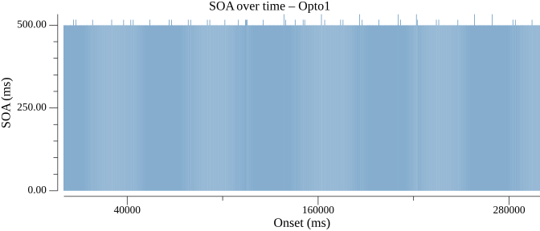

# Events Statistics Report

## Duration Statistics (ms)

| Type | N | Min | P5 | P25 | P50 | P75 | P95 | Max | Range | P95-P05 | Mean | SD |
| --- | --- | --- | --- | --- | --- | --- | --- | --- | --- | --- | --- | --- |
| TTLin1 | 599 | 5.0 | 5.0 | 5.0 | 5.2 | 5.2 | 5.2 | 5.5 | 0.5 | 0.2 | 5.2 | 0.12 |
| Opto1 | 598 | 224.5 | 224.5 | 224.8 | 224.8 | 225.0 | 225.0 | 258.2 | 33.8 | 0.5 | 225.4 | 3.30 |

### Duration Histograms

> **Warning:** 1 outlier(s) excluded from Opto1 (> 50.000 ms from median)

## Inter-Onset Interval / Jitter Statistics (ms)

| Type | N | Min | P5 | P25 | P50 | P75 | P95 | Max | Range | P95-P05 | Mean | SD |
| --- | --- | --- | --- | --- | --- | --- | --- | --- | --- | --- | --- | --- |
| TTLin1 | 598 | 499.5 | 499.5 | 499.8 | 499.8 | 500.0 | 513.8 | 530.5 | 31.0 | 14.2 | 501.1 | 4.50 |
| Opto1 | 598 | 499.5 | 499.5 | 499.8 | 499.8 | 499.8 | 516.2 | 533.0 | 33.5 | 16.8 | 501.1 | 5.30 |

### Jitter Histograms

## Paired-Event Onset Differences relative to TTLin1 (ms)

### Tables

| Type | N | Min | P5 | P25 | P50 | P75 | P95 | Max | Range | P95-P05 | Mean | SD |
| --- | --- | --- | --- | --- | --- | --- | --- | --- | --- | --- | --- | --- |
| TTLin1→Opto1 | 599 | 16.5 | 19.8 | 22.2 | 24.2 | 25.0 | 27.0 | 41.2 | 24.8 | 7.2 | 23.8 | 2.33 |

### Paired-Event Histograms

## Timeline Plots

