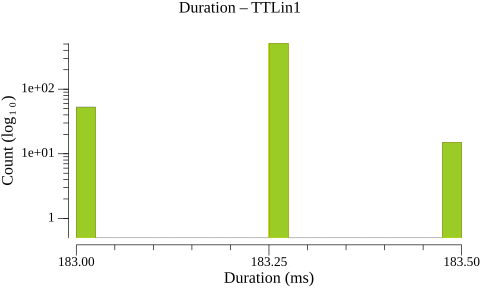
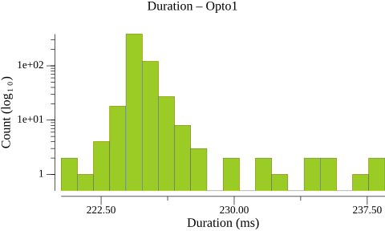
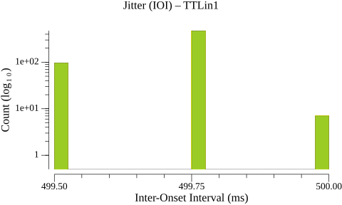
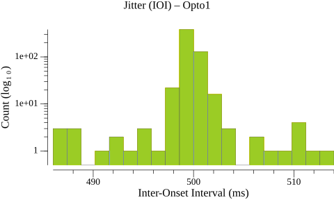
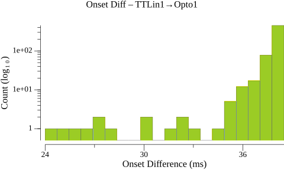
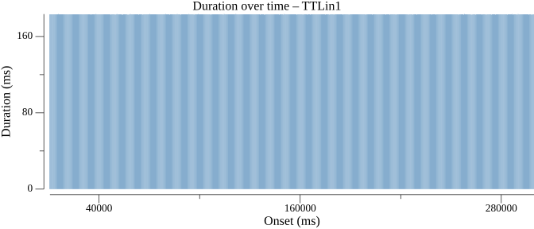
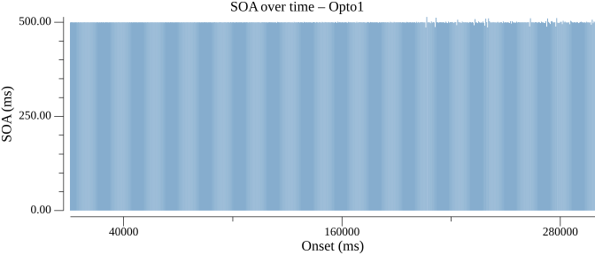

# Events Statistics Report

## Duration Statistics (ms)

| Type | N | Min | P5 | P25 | P50 | P75 | P95 | Max | Range | P95-P05 | Mean | SD |
| --- | --- | --- | --- | --- | --- | --- | --- | --- | --- | --- | --- | --- |
| TTLin1 | 579 | 183.0 | 183.0 | 183.2 | 183.2 | 183.2 | 183.2 | 183.5 | 0.5 | 0.2 | 183.2 | 0.08 |
| Opto1 | 579 | 220.2 | 224.0 | 224.5 | 224.8 | 225.0 | 226.2 | 238.5 | 18.2 | 2.2 | 225.0 | 1.54 |

### Duration Histograms

## Inter-Onset Interval / Jitter Statistics (ms)

| Type | N | Min | P5 | P25 | P50 | P75 | P95 | Max | Range | P95-P05 | Mean | SD |
| --- | --- | --- | --- | --- | --- | --- | --- | --- | --- | --- | --- | --- |
| TTLin1 | 578 | 499.5 | 499.5 | 499.8 | 499.8 | 499.8 | 499.8 | 500.0 | 0.5 | 0.2 | 499.7 | 0.10 |
| Opto1 | 578 | 486.0 | 498.2 | 499.5 | 499.8 | 500.0 | 501.3 | 514.0 | 28.0 | 3.0 | 499.7 | 2.11 |

### Jitter Histograms

## Paired-Event Onset Differences relative to TTLin1 (ms)

### Tables

| Type | N | Min | P5 | P25 | P50 | P75 | P95 | Max | Range | P95-P05 | Mean | SD |
| --- | --- | --- | --- | --- | --- | --- | --- | --- | --- | --- | --- | --- |
| TTLin1→Opto1 | 579 | 24.0 | 36.2 | 38.0 | 38.2 | 38.2 | 38.5 | 38.5 | 14.5 | 2.2 | 37.8 | 1.55 |

### Paired-Event Histograms

## Timeline Plots

