# Events Statistics Report

## Duration Statistics (ms)

| Type | N | Min | P5 | P25 | P50 | P75 | P95 | Max | Range | P95-P05 | Mean | SD |
| --- | --- | --- | --- | --- | --- | --- | --- | --- | --- | --- | --- | --- |
| TTLin1 | 1000 | 5.0 | 5.2 | 5.2 | 5.2 | 5.5 | 5.5 | 6.2 | 1.2 | 0.2 | 5.3 | 0.13 |
| Mic1 | 1000 | 220.5 | 220.5 | 220.8 | 220.8 | 223.8 | 230.2 | 254.5 | 34.0 | 9.8 | 222.8 | 3.73 |
| Opto1 | 998 | 220.0 | 220.2 | 220.2 | 220.5 | 220.5 | 220.8 | 220.8 | 0.8 | 0.5 | 220.4 | 0.17 |

### Duration Histograms

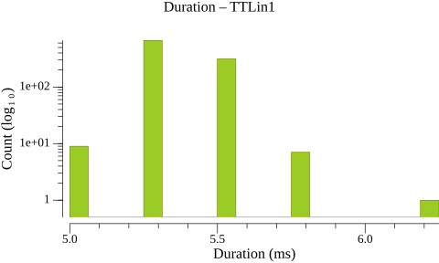

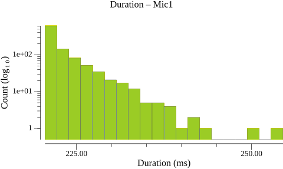

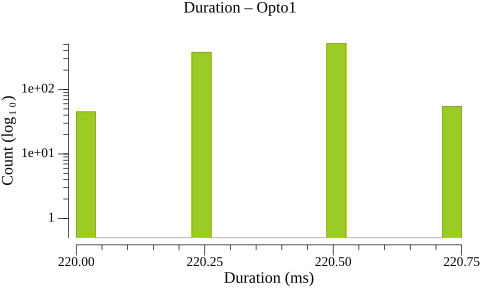

## Inter-Onset Interval / Jitter Statistics (ms)

| Type | N | Min | P5 | P25 | P50 | P75 | P95 | Max | Range | P95-P05 | Mean | SD |
| --- | --- | --- | --- | --- | --- | --- | --- | --- | --- | --- | --- | --- |
| TTLin1 | 999 | 493.5 | 499.5 | 499.8 | 499.8 | 500.0 | 500.0 | 500.5 | 7.0 | 0.5 | 499.9 | 0.27 |
| Mic1 | 999 | 482.5 | 494.0 | 497.2 | 500.2 | 502.0 | 506.0 | 518.2 | 35.8 | 12.0 | 499.9 | 3.79 |
| Opto1 | 997 | 499.5 | 499.5 | 499.8 | 499.8 | 500.0 | 500.2 | 500.2 | 0.8 | 0.8 | 499.9 | 0.19 |

### Jitter Histograms

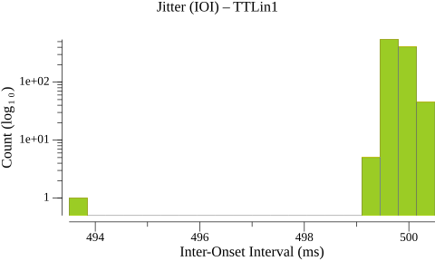

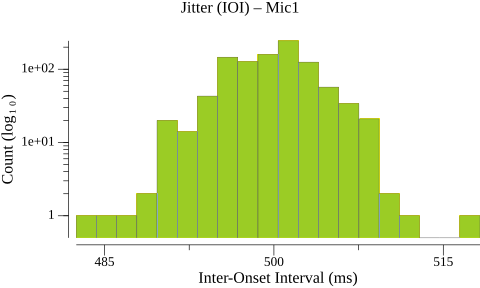

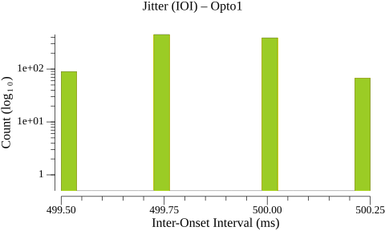

## Paired-Event Onset Differences relative to TTLin1 (ms)

### Tables

| Type | N | Min | P5 | P25 | P50 | P75 | P95 | Max | Range | P95-P05 | Mean | SD |
| --- | --- | --- | --- | --- | --- | --- | --- | --- | --- | --- | --- | --- |
| TTLin1→Mic1 | 1000 | 62.0 | 66.5 | 69.0 | 70.8 | 72.6 | 75.5 | 87.8 | 25.8 | 9.0 | 70.9 | 2.77 |

| Type | N | Min | P5 | P25 | P50 | P75 | P95 | Max | Range | P95-P05 | Mean | SD |
| --- | --- | --- | --- | --- | --- | --- | --- | --- | --- | --- | --- | --- |
| TTLin1→Opto1 | 998 | 37.8 | 38.2 | 38.2 | 38.5 | 38.5 | 38.8 | 39.0 | 1.2 | 0.5 | 38.5 | 0.17 |

### Paired-Event Histograms

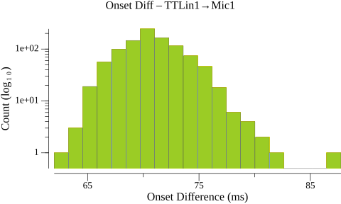

> **Warning:** 2 outlier(s) excluded from TTLin1→Opto1 (> 50.000 ms from median)

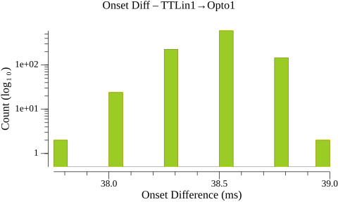

## Timeline Plots

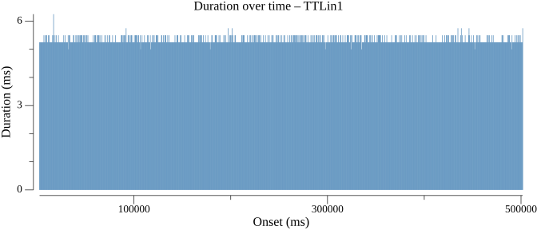

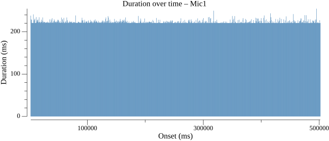

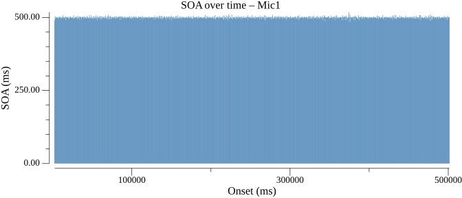

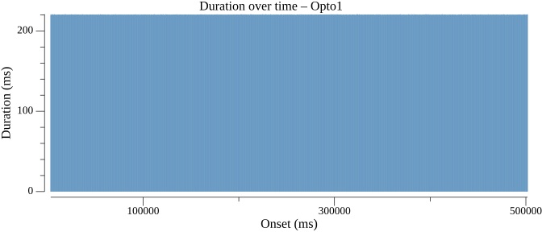

