# Events Statistics Report

## Duration Statistics (ms)

| Type | N | Min | P5 | P25 | P50 | P75 | P95 | Max | Range | P95-P05 | Mean | SD |
| --- | --- | --- | --- | --- | --- | --- | --- | --- | --- | --- | --- | --- |
| TTLin1 | 1010 | 200.0 | 200.0 | 200.2 | 200.2 | 200.5 | 200.5 | 200.8 | 0.8 | 0.5 | 200.3 | 0.15 |
| Opto1 | 1010 | 230.8 | 231.0 | 231.2 | 231.2 | 231.5 | 231.8 | 232.0 | 1.2 | 0.8 | 231.4 | 0.19 |
| Mic1 | 1010 | 232.2 | 232.5 | 232.8 | 232.8 | 233.0 | 233.0 | 234.5 | 2.2 | 0.5 | 232.8 | 0.19 |

### Duration Histograms

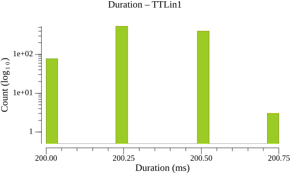

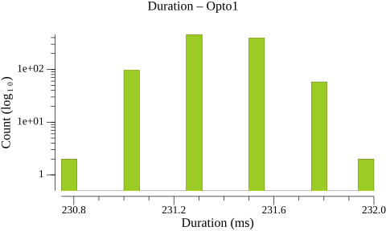

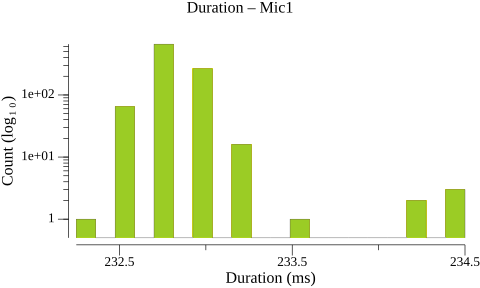

## Inter-Onset Interval / Jitter Statistics (ms)

| Type | N | Min | P5 | P25 | P50 | P75 | P95 | Max | Range | P95-P05 | Mean | SD |
| --- | --- | --- | --- | --- | --- | --- | --- | --- | --- | --- | --- | --- |
| TTLin1 | 1009 | 499.5 | 499.5 | 499.8 | 499.8 | 499.8 | 499.8 | 500.2 | 0.8 | 0.2 | 499.7 | 0.11 |
| Opto1 | 1009 | 499.2 | 499.5 | 499.5 | 499.8 | 499.8 | 500.0 | 500.0 | 0.8 | 0.5 | 499.7 | 0.15 |
| Mic1 | 1009 | 487.5 | 487.5 | 499.2 | 499.2 | 499.2 | 511.0 | 522.5 | 35.0 | 23.5 | 499.7 | 6.65 |

### Jitter Histograms

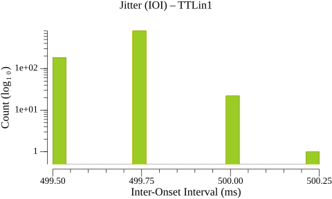

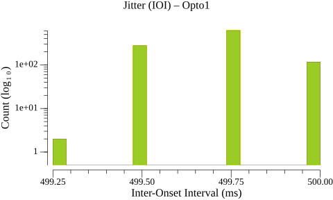

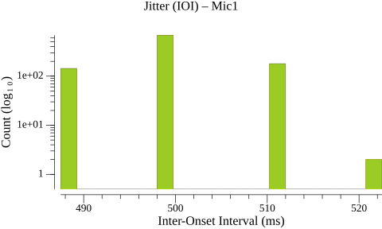

## Paired-Event Onset Differences relative to TTLin1 (ms)

### Tables

| Type | N | Min | P5 | P25 | P50 | P75 | P95 | Max | Range | P95-P05 | Mean | SD |
| --- | --- | --- | --- | --- | --- | --- | --- | --- | --- | --- | --- | --- |
| TTLin1→Opto1 | 1010 | 19.0 | 19.2 | 19.5 | 19.5 | 19.8 | 19.8 | 20.2 | 1.2 | 0.5 | 19.6 | 0.20 |

| Type | N | Min | P5 | P25 | P50 | P75 | P95 | Max | Range | P95-P05 | Mean | SD |
| --- | --- | --- | --- | --- | --- | --- | --- | --- | --- | --- | --- | --- |
| TTLin1→Mic1 | 1010 | 74.5 | 78.4 | 83.0 | 86.8 | 90.2 | 95.0 | 98.0 | 23.5 | 16.6 | 86.7 | 4.84 |

### Paired-Event Histograms

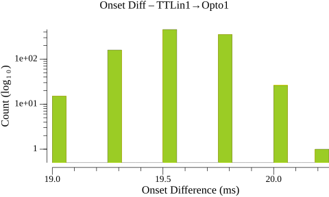

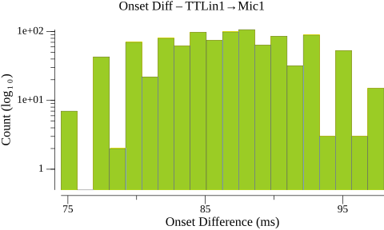

## Timeline Plots

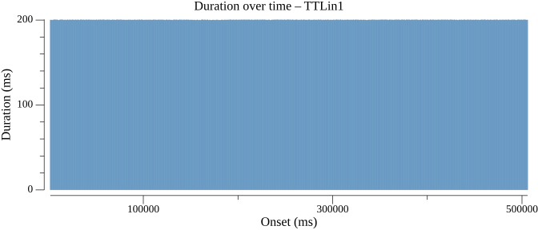

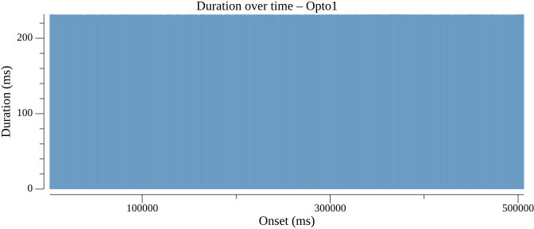

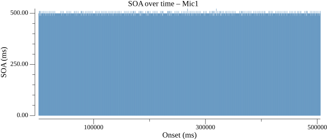

