# Events Statistics Report

## Duration Statistics (ms)

| Type | N | Min | P5 | P25 | P50 | P75 | P95 | Max | Range | P95-P05 | Mean | SD |
| --- | --- | --- | --- | --- | --- | --- | --- | --- | --- | --- | --- | --- |
| Opto1 | 1010 | 223.8 | 224.0 | 224.0 | 224.2 | 224.2 | 224.5 | 241.2 | 17.5 | 0.5 | 224.6 | 2.60 |
| TTLin1 | 1010 | 200.0 | 200.0 | 200.2 | 200.2 | 200.5 | 200.5 | 200.8 | 0.8 | 0.5 | 200.3 | 0.15 |
| Mic1 | 1010 | 224.5 | 224.8 | 225.0 | 225.2 | 225.5 | 225.8 | 247.0 | 22.5 | 1.0 | 225.8 | 3.19 |

### Duration Histograms

> **Warning:** 2 outlier(s) excluded from Opto1 (> 50.000 ms from median)

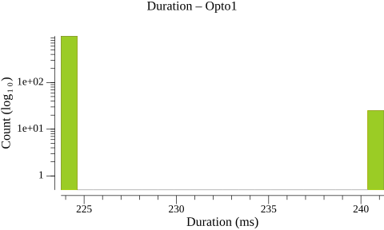

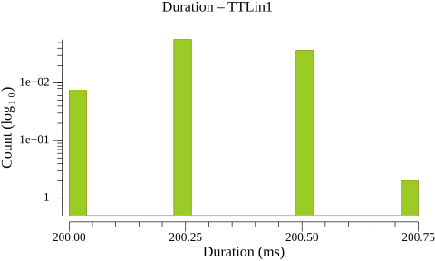

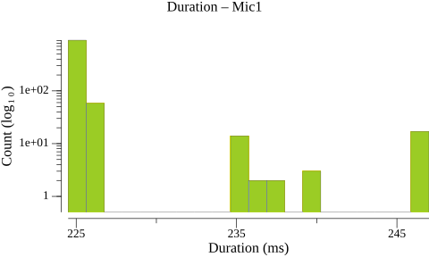

## Inter-Onset Interval / Jitter Statistics (ms)

| Type | N | Min | P5 | P25 | P50 | P75 | P95 | Max | Range | P95-P05 | Mean | SD |
| --- | --- | --- | --- | --- | --- | --- | --- | --- | --- | --- | --- | --- |
| Opto1 | 1009 | 499.2 | 499.5 | 499.5 | 499.8 | 499.8 | 500.0 | 516.5 | 17.2 | 0.5 | 500.2 | 2.82 |
| TTLin1 | 1009 | 499.2 | 499.5 | 499.8 | 499.8 | 499.8 | 500.5 | 516.5 | 17.2 | 1.0 | 500.2 | 2.64 |
| Mic1 | 1009 | 487.5 | 487.8 | 499.2 | 499.2 | 499.2 | 511.0 | 534.0 | 46.5 | 23.2 | 500.2 | 6.71 |

### Jitter Histograms

> **Warning:** 2 outlier(s) excluded from Opto1 (> 50.000 ms from median)

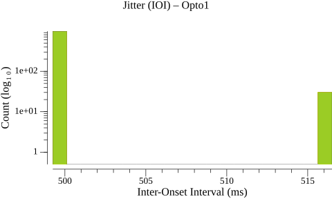

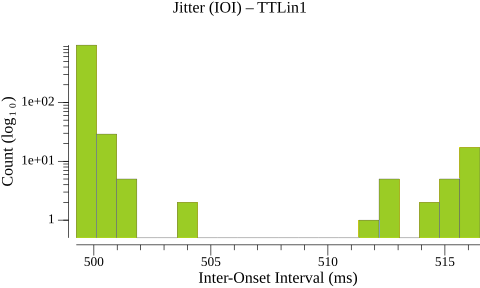

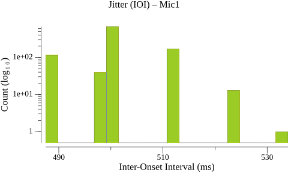

## Paired-Event Onset Differences relative to TTLin1 (ms)

### Tables

| Type | N | Min | P5 | P25 | P50 | P75 | P95 | Max | Range | P95-P05 | Mean | SD |
| --- | --- | --- | --- | --- | --- | --- | --- | --- | --- | --- | --- | --- |
| TTLin1→Opto1 | 1010 | 24.0 | 24.2 | 24.5 | 24.8 | 24.8 | 25.5 | 41.2 | 17.2 | 1.2 | 24.8 | 1.11 |

| Type | N | Min | P5 | P25 | P50 | P75 | P95 | Max | Range | P95-P05 | Mean | SD |
| --- | --- | --- | --- | --- | --- | --- | --- | --- | --- | --- | --- | --- |
| TTLin1→Mic1 | 1010 | 77.5 | 80.8 | 85.2 | 88.6 | 92.0 | 96.0 | 99.5 | 22.0 | 15.2 | 88.6 | 4.61 |

### Paired-Event Histograms

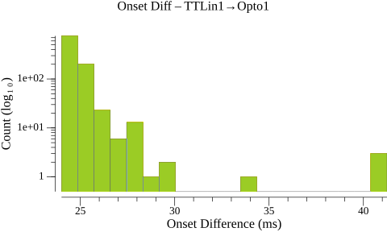

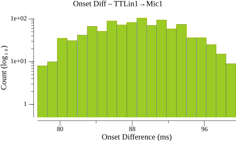

## Timeline Plots

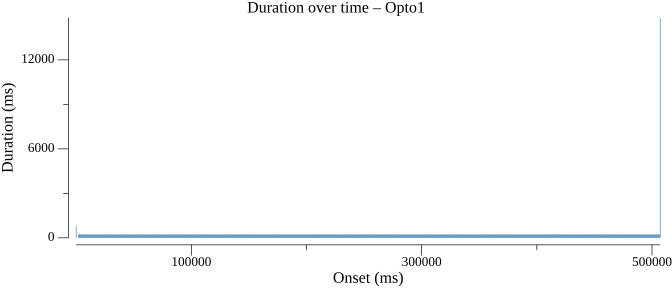

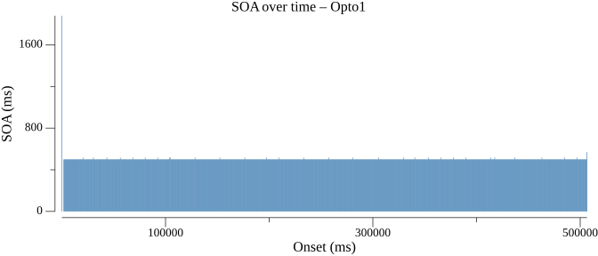

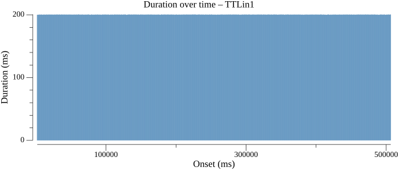

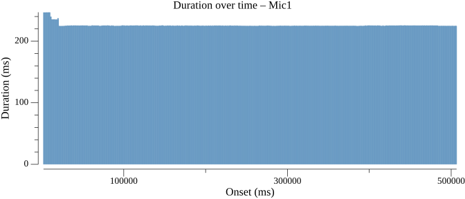

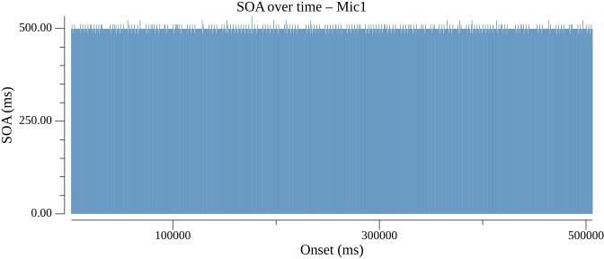

