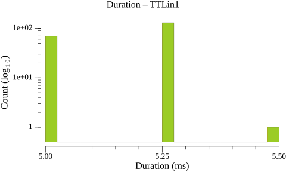
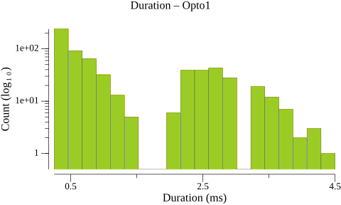
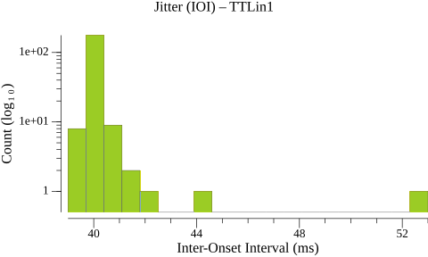
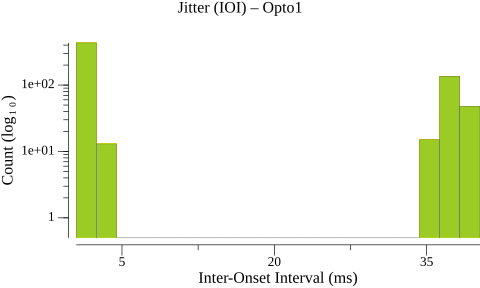
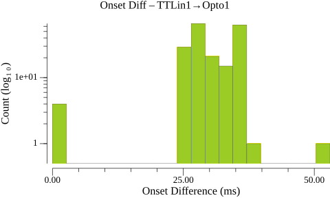
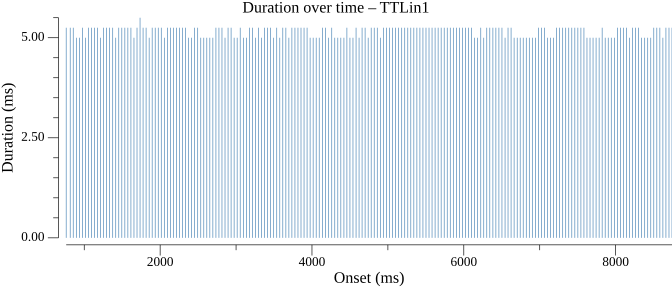
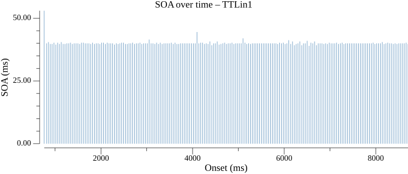
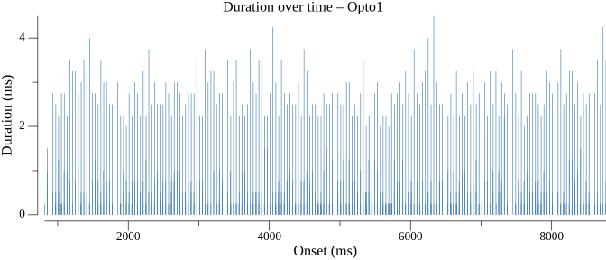
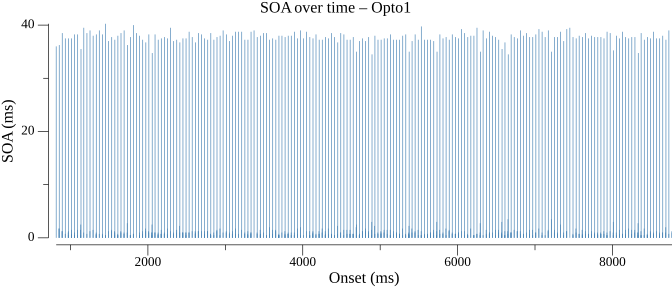

# Events Statistics Report

## Duration Statistics (ms)

| Type | N | Min | P5 | P25 | P50 | P75 | P95 | Max | Range | P95-P05 | Mean | SD |
| --- | --- | --- | --- | --- | --- | --- | --- | --- | --- | --- | --- | --- |
| TTLin1 | 200 | 5.0 | 5.0 | 5.0 | 5.2 | 5.2 | 5.2 | 5.5 | 0.5 | 0.2 | 5.2 | 0.12 |
| Opto1 | 645 | 0.2 | 0.2 | 0.2 | 0.5 | 2.2 | 3.2 | 4.5 | 4.2 | 3.0 | 1.2 | 1.13 |

### Duration Histograms

## Inter-Onset Interval / Jitter Statistics (ms)

| Type | N | Min | P5 | P25 | P50 | P75 | P95 | Max | Range | P95-P05 | Mean | SD |
| --- | --- | --- | --- | --- | --- | --- | --- | --- | --- | --- | --- | --- |
| TTLin1 | 199 | 39.0 | 39.8 | 39.9 | 40.0 | 40.0 | 40.8 | 53.0 | 14.0 | 1.0 | 40.1 | 1.03 |
| Opto1 | 644 | 0.5 | 0.5 | 0.8 | 1.2 | 37.2 | 38.7 | 40.2 | 39.8 | 38.2 | 12.4 | 17.01 |

### Jitter Histograms

## Paired-Event Onset Differences relative to TTLin1 (ms)

### Tables

| Type | N | Min | P5 | P25 | P50 | P75 | P95 | Max | Range | P95-P05 | Mean | SD |
| --- | --- | --- | --- | --- | --- | --- | --- | --- | --- | --- | --- | --- |
| TTLin1→Opto1 | 200 | 0.0 | 25.7 | 26.8 | 29.2 | 35.1 | 36.2 | 53.0 | 53.0 | 10.5 | 30.1 | 6.04 |

### Paired-Event Histograms

## Timeline Plots

