# Events Statistics Report

## Duration Statistics (ms)

| Type | N | Min | P5 | P25 | P50 | P75 | P95 | Max | Range | P95-P05 | Mean | SD |
| --- | --- | --- | --- | --- | --- | --- | --- | --- | --- | --- | --- | --- |
| TTLin1 | 1010 | 200.0 | 200.0 | 200.0 | 200.2 | 200.5 | 200.5 | 200.8 | 0.8 | 0.5 | 200.2 | 0.23 |
| Opto1 | 1010 | 221.2 | 221.5 | 221.8 | 221.8 | 221.8 | 222.0 | 222.2 | 1.0 | 0.5 | 221.8 | 0.18 |
| Mic1 | 1010 | 232.8 | 232.7 | 233.0 | 233.0 | 233.2 | 244.0 | 268.8 | 36.0 | 11.2 | 235.0 | 4.17 |

### Duration Histograms

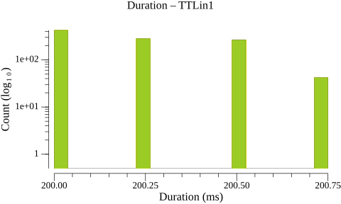

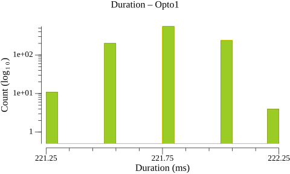

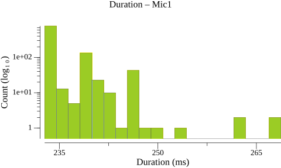

## Inter-Onset Interval / Jitter Statistics (ms)

| Type | N | Min | P5 | P25 | P50 | P75 | P95 | Max | Range | P95-P05 | Mean | SD |
| --- | --- | --- | --- | --- | --- | --- | --- | --- | --- | --- | --- | --- |
| TTLin1 | 1009 | 499.8 | 500.0 | 500.0 | 500.0 | 500.0 | 500.2 | 500.5 | 0.8 | 0.2 | 500.0 | 0.11 |
| Opto1 | 1009 | 499.5 | 499.8 | 500.0 | 500.0 | 500.2 | 500.2 | 500.5 | 1.0 | 0.5 | 500.0 | 0.19 |
| Mic1 | 1009 | 479.8 | 490.5 | 501.2 | 501.2 | 501.5 | 512.0 | 517.0 | 37.2 | 21.5 | 500.1 | 5.63 |

### Jitter Histograms

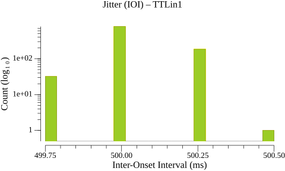

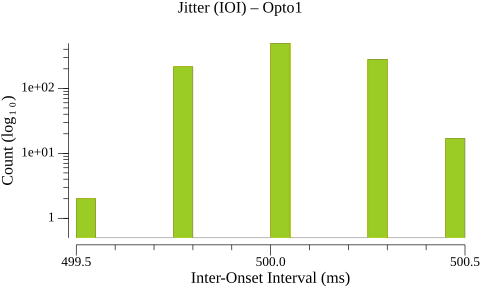

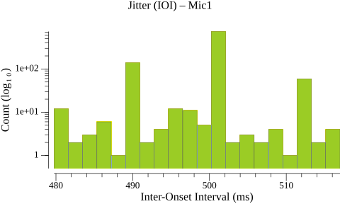

## Paired-Event Onset Differences relative to TTLin1 (ms)

### Tables

| Type | N | Min | P5 | P25 | P50 | P75 | P95 | Max | Range | P95-P05 | Mean | SD |
| --- | --- | --- | --- | --- | --- | --- | --- | --- | --- | --- | --- | --- |
| TTLin1→Opto1 | 1010 | 6.0 | 6.8 | 9.8 | 13.0 | 16.8 | 19.5 | 20.5 | 14.5 | 12.8 | 13.1 | 4.07 |

| Type | N | Min | P5 | P25 | P50 | P75 | P95 | Max | Range | P95-P05 | Mean | SD |
| --- | --- | --- | --- | --- | --- | --- | --- | --- | --- | --- | --- | --- |
| TTLin1→Mic1 | 1010 | 68.5 | 79.2 | 82.8 | 87.2 | 93.0 | 100.2 | 106.8 | 38.2 | 21.0 | 88.2 | 6.82 |

### Paired-Event Histograms

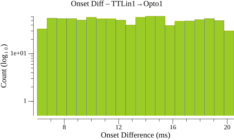

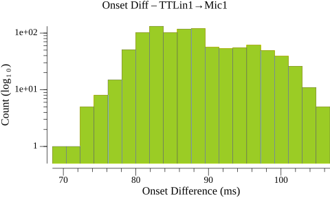

## Timeline Plots

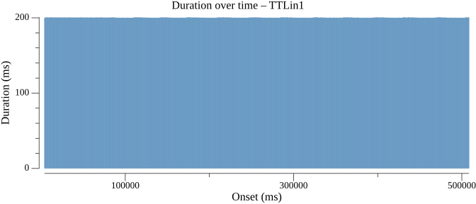

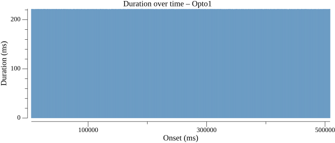

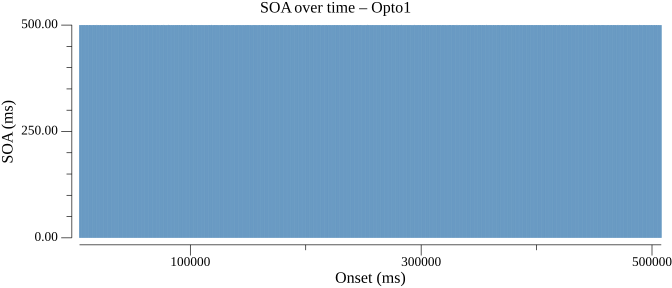

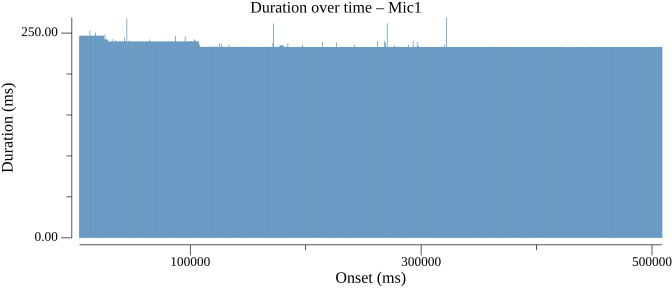

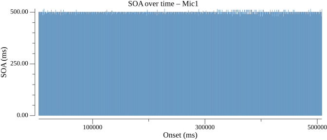

